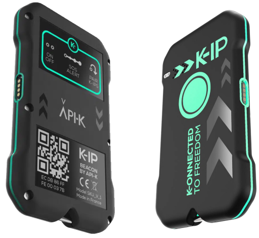

# Geo API v2 documentation

This API allow users to retreive raw data transmitted by their geo capable
devices. This API supports following device types :

* APIK KIP ;
* APIK MARKER.

The complete Swagger doc is available at : 
[Geo API v2 Swagger doc](https://api.api-k.com/geo/v2/swagger/).

## Authentication

Authentication is a basic one. To retreive your credentials, you'll have to
connect to Maker portal (soon released). Basic authentication is made of a
username and a password. username is unmutable. Password can be one of those :

* rw primary key : primary key to consume data with no restriction ;
* rw secondary key : secondary key to consume data with no restriction ;
* ro primary key : primary key to consume data in readonly mode ;
* ro secondary key : secondary key to consume data in readonly mode.

For each scope (rw or ro), primary and secondary can be used equaly. It allows
you to roll regulary keys with no service interruption.

## Devices

The first endpoint is `devices`. By requesting `/devices`, you'll have the
opportunity to request all information of each device :

* `id` : this information is used to identify the device in all other resources ;
* `eui` : this is the unique id which is physically written on the device ;
* `manufacturer` and `model` are obvious !

This is a KIP :

The `EUI` is just under the QR-Code at the back of the device : `ecdb86ffff00037b`.